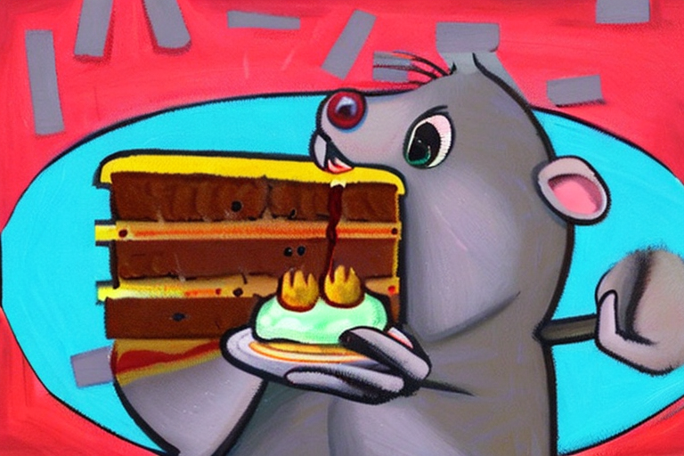
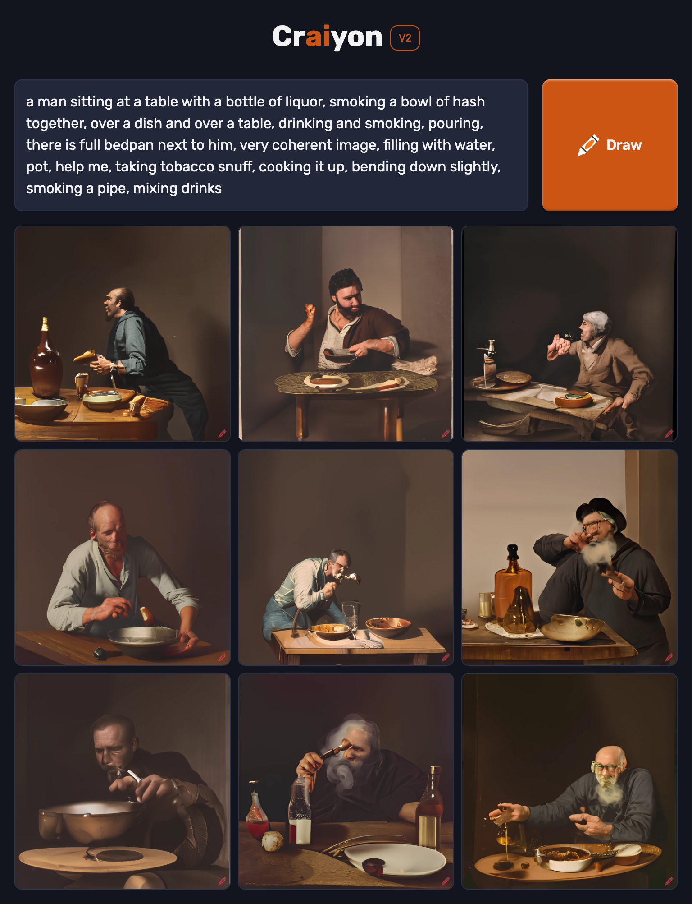
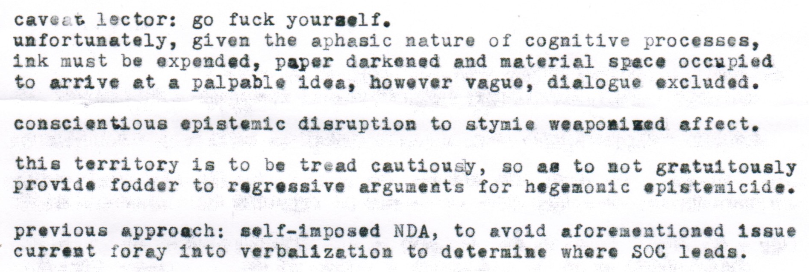

# The Humiliation of the Word - R&D

## Versioning


- v0.0 : tests
- v0.5 : pre-official replicate JS client
- v0.9 : final tests
- v1.0 : FUNCTIONAL T2I2T
- v1.1 : + IPP printing
- v1.2 : + IPP & thermal printing
- v1.3 : + USB & thermal printing
- v2.0 : FUNCTIONAL T2I2T + USB & thermal printing
- v2.1 : T2I2T2S2T + USB & thermal printing
- v2.2 : T2I2T2S2T + USB & thermal printing + audio output
- v3.0 : FUNCTIONAL T2I2T2S2T + USB & thermal printing + audio output
- v3.1 : + arduino (user-triggered async runthrough)
- v3.2 : User-actuated async runthrough
- v3.3 : Full user-actuated async runthrough (+ audio input)
- v4.0 : FUNCTIONAL T2I2T2S2T2S (USB + thermal printing, audio in & out)
- v4.1 : first web port (localhost) --> OK
- v4.2 : attempt at heroku --> failed
- v4.3 : FUNCTIONAL S2T2I2T2SxP (audio in, USB printing, NO thermal printing, audio out)
- v4.4 : FUNCTIONAL S2T2I2T2S (audio in, USB printing, thermal printing, audio out)
- v4.5 : FUNCTIONAL LOCALHOST S2T2I2T2SxP (audio in, USB printing, NO thermal printing, audio out)
- v4.6 : FUNCTIONAL LOCALHOST S2T2I2T2S (audio in, USB printing, thermal printing, audio out)
- v4.7 : FUNCTIONAL LOCALHOST S2T2I2T2S (audio in, USB printing, thermal printing, audio out) + errorHandling
- v4.8 : MVP FUNCTIONAL LOCALHOST S2T2I2T2S (audio in & out)
- v4.9 : MVP FUNCTIONAL LOCALHOST S2T2I2T2S (audio in & out) + INTERFACE!
- v5.0 : FUNCTIONAL INTERFACED LOCALHOST S2T2I2T2S --> HotW?

| prompt | image1 | text1 | image2 | text2 |
| -- | -- | -- | -- | -- |
| "an angry hamster eating brie in an impressionist style" |  | "a painting of a hamster eating a piece of cheese, a storybook illustration by Pamela Ascherson, deviantart, pop surrealism, deviantart, storybook illustration, made of cheese" |  | "a painting of a mouse eating a piece of cheese, a pastel by Raphaelle Peale, featured on deviantart, pop surrealism, storybook illustration, made of cheese, white background" |

- v1.1 : T2I2T + P

| prompt | image1 | text1 | image2 | text2 |
| -- | -- | -- | -- | -- |
| "an angry hamster eating brie in an impressionist style" |  | "a painting of a rat eating a piece of cake, a pastel by Paul Feeley, featured on deviantart, sots art, 2d game art, storybook illustration, playstation 5 screenshot" |  | "a cartoon rat holding a piece of cake, a pastel by Art Spiegelman, trending on deviantart, pop surrealism, storybook illustration, official art, art on instagram" |

future: all human intervention (e.g. bringing photo to scanner/cam, bringing text to cam, listening and repeating text) & getting paid the same

# R
# D

## 230219 - comparative T2I
### [Replicate T2I models](https://replicate.com/collections/text-to-image)

| model | [stability-ai/stable-diffusion](https://replicate.com/stability-ai/stable-diffusion) | [kuprel/min-dalle](https://replicate.com/kuprel/min-dalle) | [borisdayma/dalle-mini](https://replicate.com/borisdayma/dalle-mini) |
|--|--|--|--|
| processor | Nvidia A100 GPU | Nvidia A100 GPU | Nvidia A100 GPU |
| time (est.) | <2s | <16s (var.) | <109s (var.) |

### Prompt
"an angry hamster eating brie in an impressionist style"
### Results

| model | stability-ai/stable-diffusion | kuprel/min-dalle | borisdayma/dalle-mini |
|--|--|--|--|
| time | 14.2 s | 16.3 s | 30.8 s |
| image |  |  |  |

### Choice 
[stability-ai/stable-diffusion](https://replicate.com/stability-ai/stable-diffusion)

## 230219 - comparative I2T
### [Replicate I2T models](https://replicate.com/collections/image-to-text)

| model | [salesforce/blip](https://replicate.com/salesforce/blip) | [methexis-inc/img2prompt](https://replicate.com/methexis-inc/img2prompt) | [pharmapsychotic/clip-interrogator](https://replicate.com/pharmapsychotic/clip-interrogator) |
|--|--|--|--|
| processor | Nvidia T4 GPU | Nvidia T4 GPU | Nvidia T4 GPU |
| time (est.) | <1s | <22s | <48s |

### Image
 <br>

### Results

| model | salesforce/blip | methexis-inc/img2prompt | pharmapsychotic/clip-interrogator |
|---|---|---|---|
| time (act.) | 1.1 s | 19.7 s | 92.3 s |
| caption | “Caption: a man holding a bottle of water over his head” | “a man holding a bottle of water over his head, a still life by Zou Yigui, cgsociety, neo-dada, sabattier filter, stock photo, sabattier effect” | “a man sitting at a table with a bottle of liquor, a photo, reddit, process art, there is full bedpan next to him, bending over, i_5589.jpeg, body fitted dart manipulation, he is a mad old man, browns and whites, 4 2 0, cake, loosely cropped, 4 k sharpening, dad” |
| Craiyon |  |  |  |

### Results pt.2

| CLIP | ViT-H-14/laion (best) | ViT-L-14/openai (best) | ViT-H-14/laion (fast) | ViT-L-14/openai (fast) |
|---|---|---|---|---|
| time (s) | 109.7 | 42.3 |  | 2.3 |
| caption | a man sitting at a table with a bottle of liquor, a photo, reddit, process art, there is full bedpan next to him, bending over, i_5589.jpeg, body fitted dart manipulation, he is a mad old man, browns and whites, 4 2 0, cake, loosely cropped, 4 k sharpening, dad | a man sitting at a table with a bottle of liquor, inspired by Ai Weiwei, neo-dada, photo taken in 2018, smoking a bowl of hash together, blog-photo, épaule devant pose, artforum, anguish, jean gireaud, trending on artforum, gonzo, vignette, stalingrad, ny | a man sitting at a table with a bottle of liquor, smoking a bowl of hash together, over a dish and over a table, drinking and smoking, pouring, there is full bedpan next to him, very coherent image, filling with water, pot, help me, taking tobacco snuff, cooking it up, bending down slightly, smoking a pipe, mixing drinks | a man sitting at a table with a bottle of liquor, drinking and smoking, jean gireaud, épaule devant pose, dsrl photo, chianti molotov cocktails, inspired by Ai Weiwei, inspired by Wolf Vostell, portrait of an alcoholic, la nouvelle vague, inspired by Brassaï, three body problem |
| Craiyon |  |  |  |  |

## 230220 - printers / IPP

### Printers
#### HP Photosmart 5510 e-All-in-One Printer series - B111
- [HP](https://support.hp.com/ca-en/product/hp-photosmart-5510-e-all-in-one-printer-series-b111/5053904)
- [driver](https://support.hp.com/ca-en/drivers/selfservice/hp-photosmart-5510-e-all-in-one-printer-series-b111/5053904)
- IPP name: `Photosmart 5510 series [789327] http://HP789327.local.:631/ipp/printer`
#### Brother MFC-7840W
- [Brother](https://support.brother.com/g/b/producttop.aspx?c=us_ot&lang=en&prod=mfc7840w_all)  
- [specs](https://support.brother.com/g/b/spec.aspx?c=ca&lang=en&prod=mfc7840w_all)
- [Setting up on wireless network](https://support.brother.com/g/b/faqend.aspx?c=us_ot&lang=en&prod=mfc7840w_all&ftype3=2041&faqid=faq00100429_012) --> OK  
- [NETWORK USER’S GUIDE](https://download.brother.com/welcome/doc002333/mfc7840w_eng_net_a.pdf)
- [PRINTER PAGE!!](http://brn008077e90263.local./main/main.html)


Unsupported document-format "application/pdf" --> use CUPS

Must be image buffer --> works if use fs.readFileSync on local file!
image buffer from URL?


### Python
pyipp ([pypi](https://pypi.org/project/pyipp/)/[gh](https://github.com/ctalkington/python-ipp))  
pyipptool ([gh](https://github.com/ezeep/pyipptool))

### Node
#### https://github.com/fvdm/nodejs-brothermfc


## 230220 - T2I2T
### Python script:
```
import replicate
import webbrowser
modelP2I = replicate.models.get("stability-ai/stable-diffusion")
modelI2P = replicate.models.get("methexis-inc/img2prompt")
outputI2P = "an angry hamster eating brie in an impressionist style"
i = 1
while i < 4:
    # run P2I
    outputP2I = modelP2I.predict(prompt=outputI2P)[0]
    print(outputP2I)
    webbrowser.open(outputP2I)
    # run I2P
    inputs = { 'image': outputP2I, }
    outputI2P = modelI2P.predict(**inputs)
    print(outputI2P)
    # increment counter
    i += 1
```
### Results
`an angry hamster eating brie in an impressionist style` <br>
 <br>
`a painting of a mouse eating a piece of cake, a gouache by Peter de Seve, featured on deviantart, sots art, speedpainting, oil on canvas, storybook illustration` <br>
 <br>
`a painting of a mouse on a plate with a piece of cake, a storybook illustration by John Nelson Battenberg, trending on deviantart, pop surrealism, storybook illustration, whimsical, detailed painting` <br>
 <br>
`a painting of a mouse on a piece of cake, a pastel by Betye Saar, deviantart, folk art, storybook illustration, whimsical, mixed media`

## 230220 - OCR
### Python script:
```
from PIL import Image
import pytesseract
import numpy as np
print(pytesseract.image_to_string(np.array(Image.open('test3.png'))))
```
### Screenshot
#### Actual
 <br>
```
https://replicate.delivery/pbxt/p4GwceQgeyhhEENmHLRHERB5p1h4w88a5m9yl9fKUXdwHxAhA/out-0.png  
a painting of a mouse eating a piece of cake, a gouache by Peter de Seve, featured on deviantart, sots art, speedpainting, oil on canvas, storybook illustration  
https://replicate.delivery/pbxt/3QcAMrOu3IJ8OZEeIO5oalOYbeVfIelieMyZ5DbdZLmhjEDEC/out-0.png  
a painting of a mouse on a plate with a piece of cake, a storybook illustration by John Nelson Battenberg, trending on deviantart, pop surrealism, storybook illustration, whimsical, detailed painting  
https://replicate.delivery/pbxt/nJ9UM4x9zCb3P98ljgd8qJtcBA7ke9UJeOY4aIC0Ac3BlYgQA/out-0.png  
a painting of a mouse on a piece of cake, a pastel by Betye Saar, deviantart, folk art, storybook illustration, whimsical, mixed media  
```

#### OCR
```
https: //replicate.delivery/pbxt/p4GwcedgeyhhEENmHLRHERBS p1h4w8Ba5moy 19 fKUXdWHXANA/out—O. png

a painting of a mouse eating a piece of cake, a gouache by Peter de Seve, featured on deviantart, sots art, speedpainting, oil on canvas, storybook il
lustration  
https: //replicate.delivery/pbxt/3QcAMr0u31J80ZEeT050a10YbeVfe1ieMyZ5DbdZLmhjEDEC/out-0.png

a painting of a mouse on a plate with a piece of cake, a storybook illustration by John Nelson Battenberg, trending on deviantart, pop surrealism, sto
rybook illustration, whimsical, detailed painting  
https: //replicate.delivery/pbxt/nJ9UM4x92Cb3P981j gd8qJtcBA7ke9UJe0Y4aICOAC3B1YgQA/out-0. png

a painting of a mouse on a piece of cake, a pastel by Betye Saar, deviantart, folk art, storybook illustration, whimsical, mixed media
```

#### Processed
```
https: //replicate.delivery/poxt /p4Gweedg eynnEENMHLRHERSS pln4w8saSmoy LST KUXdWHxANA/out—O. png

a painting of a mouse eating a piece of cake, 2 gouache by Peter de Seve, featured on deviantart, sots art, speedpainting, oil on canvas, storybook it
lustration
https: //replicate.deLivery/pbxt/3QcAMrOu31J80ZEeT050a LOYbeV Tel ieMyZ5DbdZLnhjEDEC /out-2.png

a painting of a mouse on a plate with a piece of cake, a storybook illustration by John Nelson Battenberg, trending on deviantart, pop surrealism, sto
rybook illustration, whimsical, detailed painting
https: //replicate.deLivery/pbxt /nJ9UM4x9zCD3P981j gd8qJtcBA7ke9UJe0Y4aTCoAc3BLYaQA/out-2.png

a painting of a mouse on a piece of cake, a pastel by Betye Saar, deviantart, folk art, storybook illustration, whimsical, mixed media
```

### Typewriter 1 (Photo raw)
#### Actual
 <br>

#### OCR
```
Caveat lector: go fuck yourgelf,
unfortunately, given the aphasic nature of cognitive process.
ink must be expended, paper darkened and material space occu
to arrive et a palpable idea, however vague, dialogue exclu

conscientious epistemic disruption to atymie weapomiwed affect.

this territory is to be tread Cautiousy, so aa to mot gr

provide fodder to regressive arguments for hegemonic episte

Ms
am
¥ eis

o

an

<. 2 are +h

current foray into verbalization to determine where SOC

Loa

@


```
#### Processed
```
Cayo. % tector: go fuck yourgelf,

unfortunately, given the e:hesic nature of cognitive processes,
ink cust be expended, paper darkened and material space occupied
to arrive at a palpable idea, however vague, dialogue excluded, —

conscisntblous epistemic disruption to stymie weapomiwed affect,

this territory is to be triad Cautioucy, so ag to mot gratuitously
provice fodder to regressive argusents for hegemonic @#plstemicide,

previous mpproach: self-imposed WDA, to avoid aforenentioned issue
current foray into verbalizetion to determine where SOC leada. —

```

### Typewriter 2 (Photo cropped)
#### Actual
 <br>

#### OCR
```
Caveat lector: go fuck yourgelf,
unfortunately, given the aphasic nature of cognitive processes,
ink must be expended, paper darkened and material spece occupied
*o arrive at a palpable idea, however vague, dialogue excluded. —

conscientious @¢pistemic disruption to stymie weapomiwed affect,

this territory is to be tread cautiousy, so aa to not gratuitously
provide fodder to regressive arguments for hegemonic @pistemicide.
previous approach: self-imposed NDA, to avoid aforeuentioned issue
current foray into verbalization to determine where SOC leads,
```
#### Processed
```
Cayo. itvcctor: go fuck yourgelf,

unfortunately, given the a:hesic nature of cognitive processes,
ink cust be expended, paper darkened and material space occupied
to arrive at a palpable idea, however vague, dialogue excluded. _

conscientious é@pistexic disruption to atymie weapomined affect,

this territory is to be tread Cautiousy, so aa to not gratultoualy
proviue fodder to regressive argusents for hegemonic @pletemicide.

previous mpproach: self-imposed WDA, to avoid aforenentioned issue
current roray into verbalization to determine where SOC leada. —
```
### Typewriter 3 (Scan Raw)
#### Actual
 <br>

#### OCR
```
caveat lector: go fuck yourself.

unfortunately, given the aphasic nature of cognitive processes,
ink must be expended, paper darkened and material spece occupied
to arrive at a palpable idea, however vague, dialogue excluded.

conscientious epistemic disruption to stymie weapomimwed affect,

this territory is to be tread cautiousy, so ag to not gratuitously
provide fodder to regressive arguments for hegemonic epistemicide.

previous approach; self-imposed NDA, to avoid aforementioned issue
‘current foray into verbalization to determine where SOC leads.
```
#### Processed
```
Cave. .cctor: go fuck yourgelf.

unfortunately, given tne a. nesic acture Ci Cogniviv: .rocessis,
ing aust pe exienuaed, rapper darnened and material space occu:ied
to arrive at a palpable idea, however vague, dialogue exciuded.

conscientious epistenic disruption to styzie weapomimged affect,

this territory is to ve triad cautiou y, so ag to not gratuitously
provide fodder to regressive ariguaents for negemouic eapistesiciae.

previous approach: self-imvosed WDA, to sevoid afcresertioned issue
current :orey into verbalizetion to determine shere SUC leeds.
```

### Typewriter 4 (Scan cropped)
#### Actual
 <br>

#### OCR
```
caveat lector: go fuck yourself.

unfortunately, given the aphasic nature of cognitive processes,
ink must be expended, paper darkened and material spece occupied
to arrive at a palpable idea, however vague, dialogue excluded.

conscientious epistemic disruption to stymie weapomimed affect,

this territory is to be tread cautiousy, so as to not gratuitously
provide fodder to regressive arguments for hegemonic epistemicide.

previous approach; self-imposed NDA, to avoid aforementioned issue
current foray into verbalization to determine where SOC leads.
```
#### Processed
```
Cave. itctor: go fuck yourself.

unfortunately, given tne a nesic ai ture Ci Cognivlv: .rocessis,
ing aust oe exnended, rapper darnened and material space occuiud
to arrive at a palpable idea, however vague, dialogue exciuded.

conscientious epistenic disruption to styrie weapomiwed affect.

this territory; is to ve triad cautiou y, su ag to not gratuitously
provide fodder to regressive ar.uaents for negemouic apistesiciae.

previous approach: self-imvosed NDA, to svoid afcoresertioned issue
current :orey into verbalizetion to determine shere SUC leeds.
```

## 230228 - print debugging
### HP ink
[black ink tester - bands](http://www.refillinstructions.com/black.htm)

### Concordia printer
web access: https://10.115.140.28/home/index.html
### PNG -> JPG
[png-to-jpeg](https://www.npmjs.com/package/png-to-jpeg)


### Synchronicity issue
#### js acces method?
- [fs.readFileSync()](https://www.geeksforgeeks.org/node-js-fs-readfilesync-method/?ref=lbp) vs. [fs.createReadStream()](https://www.geeksforgeeks.org/node-js-fs-createreadstream-method/)?


### 230301 - Update to Official client
OFFICIAL REPLICATE JS CLIENT ==> [GH](https://github.com/replicate/replicate-js)/[NPM](https://www.npmjs.com/package/replicate) -- unstable alpha
switch from unofficial [gh](https://github.com/nicholascelestin/replicate-js)/no npm 
#### Error: Missing token --> OK
`ReplicateError: Missing API token`
[change dotenv import grammar](https://stackoverflow.com/questions/44915758/node-process-env-variable-name-returning-undefined) & [adapt to mjs](https://github.com/motdotla/dotenv/issues/89)
#### Error: Undefined T2I output
Contra unofficial client, 0th element of T2I prediction output is undefined
T2I prediction output is:
```
Prediction {
  client: ReplicateClient {
    baseURL: 'https://api.replicate.com',
    token: 'e71f49fa960b9449f60546f396d9c1d86c1d4752'
  },
  id: 'j5tyraylvbasxe3p2d3jys7iga',
  completedAt: '2023-03-01T20:53:10.508620Z',
  createdAt: '2023-03-01T20:52:21.618981Z',
  error: null,
  input: { prompt: 'an angry hamster eating brie in an impressionist style' },
  logs: 'Using seed: 2332\n' +
    '  0%|          | 0/50 [00:00<?, ?it/s]\n' +
    '  2%|▏         | 1/50 [00:03<03:02,  3.72s/it]\n' +
    '  4%|▍         | 2/50 [00:03<01:20,  1.69s/it]\n' +
    '  6%|▌         | 3/50 [00:04<00:48,  1.04s/it]\n' +
    '  8%|▊         | 4/50 [00:04<00:33,  1.37it/s]\n' +
    ' 10%|█         | 5/50 [00:04<00:25,  1.78it/s]\n' +
    ' 12%|█▏        | 6/50 [00:05<00:20,  2.18it/s]\n' +
    ' 14%|█▍        | 7/50 [00:05<00:16,  2.53it/s]\n' +
    ' 16%|█▌        | 8/50 [00:05<00:14,  2.84it/s]\n' +
    ' 18%|█▊        | 9/50 [00:05<00:13,  3.09it/s]\n' +
    ' 20%|██        | 10/50 [00:06<00:12,  3.28it/s]\n' +
    ' 22%|██▏       | 11/50 [00:06<00:11,  3.43it/s]\n' +
    ' 24%|██▍       | 12/50 [00:06<00:10,  3.54it/s]\n' +
    ' 26%|██▌       | 13/50 [00:06<00:10,  3.62it/s]\n' +
    ' 28%|██▊       | 14/50 [00:07<00:09,  3.68it/s]\n' +
    ' 30%|███       | 15/50 [00:07<00:09,  3.72it/s]\n' +
    ' 32%|███▏      | 16/50 [00:07<00:09,  3.75it/s]\n' +
    ' 34%|███▍      | 17/50 [00:07<00:08,  3.78it/s]\n' +
    ' 36%|███▌      | 18/50 [00:08<00:08,  3.79it/s]\n' +
    ' 38%|███▊      | 19/50 [00:08<00:08,  3.80it/s]\n' +
    ' 40%|████      | 20/50 [00:08<00:07,  3.81it/s]\n' +
    ' 42%|████▏     | 21/50 [00:08<00:07,  3.81it/s]\n' +
    ' 44%|████▍     | 22/50 [00:09<00:07,  3.82it/s]\n' +
    ' 46%|████▌     | 23/50 [00:09<00:07,  3.82it/s]\n' +
    ' 48%|████▊     | 24/50 [00:09<00:06,  3.82it/s]\n' +
    ' 50%|█████     | 25/50 [00:09<00:06,  3.83it/s]\n' +
    ' 52%|█████▏    | 26/50 [00:10<00:06,  3.83it/s]\n' +
    ' 54%|█████▍    | 27/50 [00:10<00:06,  3.83it/s]\n' +
    ' 56%|█████▌    | 28/50 [00:10<00:05,  3.83it/s]\n' +
    ' 58%|█████▊    | 29/50 [00:11<00:05,  3.83it/s]\n' +
    ' 60%|██████    | 30/50 [00:11<00:05,  3.83it/s]\n' +
    ' 62%|██████▏   | 31/50 [00:11<00:04,  3.83it/s]\n' +
    ' 64%|██████▍   | 32/50 [00:11<00:04,  3.83it/s]\n' +
    ' 66%|██████▌   | 33/50 [00:12<00:04,  3.83it/s]\n' +
    ' 68%|██████▊   | 34/50 [00:12<00:04,  3.83it/s]\n' +
    ' 70%|███████   | 35/50 [00:12<00:03,  3.84it/s]\n' +
    ' 72%|███████▏  | 36/50 [00:12<00:03,  3.84it/s]\n' +
    ' 74%|███████▍  | 37/50 [00:13<00:03,  3.83it/s]\n' +
    ' 76%|███████▌  | 38/50 [00:13<00:03,  3.84it/s]\n' +
    ' 78%|███████▊  | 39/50 [00:13<00:02,  3.84it/s]\n' +
    ' 80%|████████  | 40/50 [00:13<00:02,  3.83it/s]\n' +
    ' 82%|████████▏ | 41/50 [00:14<00:02,  3.84it/s]\n' +
    ' 84%|████████▍ | 42/50 [00:14<00:02,  3.83it/s]\n' +
    ' 86%|████████▌ | 43/50 [00:14<00:01,  3.83it/s]\n' +
    ' 88%|████████▊ | 44/50 [00:14<00:01,  3.84it/s]\n' +
    ' 90%|█████████ | 45/50 [00:15<00:01,  3.84it/s]\n' +
    ' 92%|█████████▏| 46/50 [00:15<00:01,  3.84it/s]\n' +
    ' 94%|█████████▍| 47/50 [00:15<00:00,  3.84it/s]\n' +
    ' 96%|█████████▌| 48/50 [00:15<00:00,  3.84it/s]\n' +
    ' 98%|█████████▊| 49/50 [00:16<00:00,  3.84it/s]\n' +
    '100%|██████████| 50/50 [00:16<00:00,  3.84it/s]\n' +
    '100%|██████████| 50/50 [00:16<00:00,  3.03it/s]',
  metrics: { predict_time: 21.078172 },
  output: [
    'https://replicate.delivery/pbxt/DEZD5XU88n7XEFJagAVpy3e5gk5UzaxpfCJXxemRuE7rptGhA/out-0.png'
  ],
  startedAt: '2023-03-01T20:52:49.430448Z',
  status: 'succeeded',
  urls: {
    get: 'https://api.replicate.com/v1/predictions/j5tyraylvbasxe3p2d3jys7iga',
    cancel: 'https://api.replicate.com/v1/predictions/j5tyraylvbasxe3p2d3jys7iga/cancel'
  },
  version: 'f178fa7a1ae43a9a9af01b833b9d2ecf97b1bcb0acfd2dc5dd04895e042863f1',
  webhookCompleted: null
}
```
`predictionT2I.output[0]` instead of `predictionT2I[0]`
#### Error: Undefined I2T output
Same as above, I2T output is:
```
Prediction {
  client: ReplicateClient {
    baseURL: 'https://api.replicate.com',
    token: 'e71f49fa960b9449f60546f396d9c1d86c1d4752'
  },
  id: 'apkom7z5pfdrpgrkybkcnnhvem',
  completedAt: '2023-03-01T21:00:15.502685Z',
  createdAt: '2023-03-01T20:59:51.906394Z',
  error: null,
  input: {
    image: 'https://replicate.delivery/pbxt/IaHy2LBBgSYYOtpynAKuPGWGrwWOREi2GLPdo7OEhdaxu1IE/out-0.png'
  },
  logs: 'Interrogating with ViT-L/14...',
  metrics: { predict_time: 23.522122 },
  output: '\n' +
    '\n' +
    "a hamster with its mouth open and a fork in it's mouth, a photorealistic painting by Cicely Hey, shutterstock contest winner, pop surrealism, hyper realism, detailed painting, creative commons attribution",
  startedAt: '2023-03-01T20:59:51.980563Z',
  status: 'succeeded',
  urls: {
    get: 'https://api.replicate.com/v1/predictions/apkom7z5pfdrpgrkybkcnnhvem',
    cancel: 'https://api.replicate.com/v1/predictions/apkom7z5pfdrpgrkybkcnnhvem/cancel'
  },
  version: '50adaf2d3ad20a6f911a8a9e3ccf777b263b8596fbd2c8fc26e8888f8a0edbb5',
  webhookCompleted: null
}
```
`predictionI2T.output` instead of `predictionI2T`

### 230301 - Issue: image print size
PNG from Replicate is 768\*768 -> [v. db21e45d / db21e45d3f7023abc2a46ee38a23973f6dce16bb082a930b0c49861f96d1e5bf](https://replicate.com/stability-ai/stable-diffusion/versions/db21e45d3f7023abc2a46ee38a23973f6dce16bb082a930b0c49861f96d1e5bf) [default](https://replicate.com/stability-ai/stable-diffusion/api#input-image_dimensions), alt. 512\*512
Print area is 768*~524

'image_dimensions': "768x768",  

photo paper sizes:
- 4x6" / 102x152mm AKA 4R AR 1.49:1
- 4x6.5" / 102x165mm --> close to 4R AR 1.62:1
- 5x7" / 127x178mm AKA 5R || "13x18cm" AR 1.4:1

make generated image 768x512 (1.5:1) & use 4R (1.49:1)


## 3D printed gear tests
### 230306
#### Racks
mod2 300mm x 5mm ; 2hm
mod2 270mm x 5mm ; 1h54m --> won't fit in actual print bed
mod2 240mm x 5mm ; 1h37m --> failed

#### Bearings
mod2 PD:40mm ID:22mm H:7mm + mod2 PD:30mm ND:8mm H:14mm (CE3_gear_bearings_i2m20t+o2m15t.stl)

#### miniCNC (from [Plotterbot](http://plotterbot.com/))
[Instructions](http://plotterbot.com/2013/12/how-to-build-a-tiny-3-axis-cnc-drawing-robot/) / [Parts]((https://www.thingiverse.com/thing:902900)) --> file error with XY gear (misbuild w/ servo horn)
downgrade to [v0.29](https://www.thingiverse.com/thing:200895) --> OK BUT raft in yellow PLA too tight

## POS printer


- [ABRA - PRINT-01 RS232/TTL/USB Thermal Receipt Printer](https://abra-electronics.com/electromechanical/thermal-printers/print-01-rs232-ttl-usb-thermal-receipt-printer.html)
- [Adafruit - Tiny Thermal Receipt Printer - TTL Serial / USB](https://www.adafruit.com/product/2751)
- [Walmart - GOOJPRT QR204 58mm Mini Embedded Receipt Thermal Printer RS232 + USB Interface High Speed Printing 50-85mm/s](https://www.walmart.ca/en/ip/GOOJPRT-QR204-58mm-Mini-Embedded-Receipt-Thermal-Printer-TTL-USB-Interface-High-Speed-Printing-50-85mm-s/78HC1528P1Q8)
- [AliExpress - QR204 Mini Embedded Printer Thermal ESC POS Receipt Parallel Panel Printer USB TTL RS232 Kiosk Printer Barcode Arduino 2 inch](https://www.aliexpress.com/i/1005004091437443.html)

### USB Port
#### escpos([npm](https://www.npmjs.com/package/escpos)/[gh](https://github.com/song940/node-escpos))

Error: `TypeError: usb.on is not a function`
[override USB version?](https://github.com/song940/node-escpos/issues/376) --> NO
added `"overrides": { "usb": "^1.9.2" }` to `package.json` --> NO
changed to `"usb": "^1.8.8"` --> NO
try `let { usb } = require('usb');` in script --> NO

try findPrinter():
```
const escpos = require('escpos');
escpos.USB = require('escpos-usb');
const device = escpos.USB.findPrinter()
console.log(device)
``` 
--> OK:
```
[
  {
    busNumber: 20,
    deviceAddress: 10,
    deviceDescriptor: {
      bLength: 18,
      bDescriptorType: 1,
      bcdUSB: 512,
      bDeviceClass: 0,
      bDeviceSubClass: 0,
      bDeviceProtocol: 0,
      bMaxPacketSize0: 64,
      idVendor: 10473,
      idProduct: 649,
      bcdDevice: 768,
      iManufacturer: 1,
      iProduct: 2,
      iSerialNumber: 3,
      bNumConfigurations: 1
    },
    portNumbers: [ 2 ]
  }
]
```
[add vID & pID](https://github.com/song940/node-escpos/tree/v3/packages/usb): `const device = new escpos.USB(10473, 649);`

try comment out `usb.on` in `escpos-usb/index.js` --> OK!
also comment out `usb.removeAllListeners('detach');` --> no additional value..

tests:
- [node-escpos/examples/index.js](https://github.com/song940/node-escpos/blob/v3/examples/index.js)
- [node-escpos/examples/codepage.js](https://github.com/song940/node-escpos/blob/v3/examples/codepage.js)

print sketchy.. 
- try increasing voltage --> not much diff + above 8.45V does not print!
- try dusting --> not much diff?

adapted to mjs with import statements

#### node-termal-printer ([npm](https://www.npmjs.com/package/node-thermal-printer)/[gh](https://github.com/Klemen1337/node-thermal-printer))

### via Arduino
#### [adafruit](https://learn.adafruit.com/mini-thermal-receipt-printer) ([PDF](https://cdn-learn.adafruit.com/downloads/pdf/mini-thermal-receipt-printer.pdf))


OTHER
try wired printer..
- node-native-printer ([npm](https://www.npmjs.com/package/node-native-printer)) --> NO: install ERR
- node-printer ([npm](https://www.npmjs.com/package/node-printer)) --> NO: deprecated
- zuzel-printer ([npm](https://www.npmjs.com/package/zuzel-printer)) 
- c410-printer ([npm](https://www.npmjs.com/package/c410-printer)) 

[print picture?](https://stackoverflow.com/questions/23437804/is-it-possible-to-print-an-image-with-node-js)


### LP stuff
[lp](https://www.man7.org/linux/man-pages/man1/lp.1.html)
[lpoptions](https://www.man7.org/linux/man-pages/man1/lpoptions.1.html)
[CUPS doc](https://www.cups.org/doc/options.html)


```
> lpstat -e                          
_192_168_037_227
Brother_MFC_7840W
Brother_MFC_7840W_2
HP_Photosmart_5510_series
Photosmart_5510_series
Photosmart_5510_series_789327_    
```

```
> lpstat -p -d
printer _192_168_037_227 is idle.  enabled since Mon 27 Feb 19:48:42 2023
printer Brother_MFC_7840W is idle.  enabled since Fri 17 Mar 10:32:43 2023
printer Brother_MFC_7840W_2 is idle.  enabled since Fri 17 Mar 10:45:23 2023
printer HP_Photosmart_5510_series is idle.  enabled since Fri 17 Mar 10:56:37 2023                         
```

```
> lpoptions -p Photosmart_5510_series    
copies=1 device-uri=dnssd://Photosmart%205510%20series%20%5B789327%5D._pdl-datastream._tcp.local./?bidi finishings=3 job-cancel-after=10800 job-hold-until=no-hold job-priority=50 job-sheets=none,none marker-change-time=1676854671 marker-colors=#000000,#000000,#000000,#000000 marker-high-levels=100,100,100,100 marker-levels=-2,-2,-2,20 marker-low-levels=20,20,20,20 marker-names=magenta,cyan,yellow,black marker-types=ink,ink,ink,ink number-up=1 printer-commands=ReportLevels printer-info='Photosmart 5510 series' printer-is-accepting-jobs=true printer-is-shared=false printer-is-temporary=false printer-location printer-make-and-model='HP Photosmart 5510 series' printer-state=3 printer-state-change-time=1677626443 printer-state-reasons=other-warning,com.hp.s.58-warning printer-type=77631500 printer-uri-supported=ipp://localhost/printers/Photosmart_5510_series
```

```
> lpoptions -p Photosmart_5510_series  -l
PageSize/Paper Size: Custom.WIDTHxHEIGHT A5 A5.FullBleed ISOB5 B5 Executive.2 *A4 A4.FullBleed Letter Letter.FullBleed Legal 3.5x5.Photo 3.5x5.Photo.FullBleed Postcard Postcard.FullBleed 4x6.Photo 4x6.Photo.WithTab 4x6.Photo.FullBleed 4x6.Photo.WithTab.FullBleed A6 A6.FullBleed 120x165mm 120x165mm.FullBleed 127x178mm.Photo 127x178mm.Photo.FullBleed 5x7.Photo 5x7.Photo.FullBleed DoublePostcard 8x10 8x10.FullBleed EnvChou4 EnvMonarch Env10 EnvPersonal EnvDL 111x146mm 4.38x6 EnvC6 EnvChou3 EnvC5 3x5.Small 4x6.Small 5x8.Small
MediaType/Paper Type: *plain-paper hp-premium-inkjet-paper hp-premium-presentation-matte other-inkjet-paper hp-advanced-photo-paper-glossy hp-premium-plus-photo-paper hp-premium-photo-paper hp-everyday-photo-paper-semi-gloss hp-everyday-photo-paper-matte other-photo-paper hp-premium-inkjet-transparency-film iron-on-tshirt-transfers other-speciality-papers glossy-greeting-card matte-greeting-card hp-professional-brochure-paper-glossy hp-professional-brochure-paper-matte plain-hagaki inkjet-hagaki photo-hagaki
OutputMode/Quality: high-speed-draft *normal best highest
HPColorMode/Color: *colorsmart colorsync grayscale application-managed AdobeRGB
ColorModel/Color Model: *RGB RGBW
HPPaperSource/Source: *Tray1
Resolution/Resolution: *300x300dpi 600x600dpi 1200x1200dpi
HPSimpleImageEnhancement/Photo Fix: *default off basic
HPGrayscaleMode/Grayscale Mode: *high-quality black-only
HPICCProfileId2/ColorSync profile: zzzzzyzzzzb zzzzzyzzzzc *None
```

set default printer: 
`lpadmin -d [printerName]` / `lpadmin -d Photosmart_5510_series` --> NO!
`lpoptions -d Photosmart_5510_series` --> OK (check w/ `lpstat -d`)

`lp -d Photosmart_5510_series /Users/mac/Documents/GitHub/CU/IMCA398/node/app/1679023720029_2.png` --> OK
`lp -d Photosmart_5510_series /Users/mac/Documents/GitHub/CU/IMCA398/node/app/1679023720029_2.png media=letter` --> NO `lp: Error - unable to access “media=letter” - No such file or directory`
`lp -d Photosmart_5510_series media=letter /Users/mac/Documents/GitHub/CU/IMCA398/node/app/1679023720029_2.png` --> NO: `lp: Error - unable to access “media=letter” - No such file or directory`
`lp -d Photosmart_5510_series -o media=letter /Users/mac/Documents/GitHub/CU/IMCA398/node/app/1679023720029_2.png` --> OK?
`lp -d Photosmart_5510_series -o media=5x7.Photo /Users/mac/Documents/GitHub/CU/IMCA398/node/app/1679023720029_2.png` --> OK!

SUCCESS! ==> `o: ' media=5x7.Photo'`


### OCR
#### [tesseractocr](https://www.npmjs.com/package/tesseractocr)
#### [node-tesseract-ocr](https://www.npmjs.com/package/node-tesseract-ocr)


### T2S
[afiaka87/tortoise-tts](https://replicate.com/afiaka87/tortoise-tts)

### S2T
[openai/whisper](https://replicate.com/openai/whisper)

### play sound
#### [play-sound](https://www.npmjs.com/package/play-sound)
#### [sound-play](npmjs.com/package/sound-play)
- `npm i sound-play`
- 
```
import sound from "sound-play";
sound.play("file.mp3");
```

### microphone
 tried [microphone](https://www.npmjs.com/package/microphone) --> NO: build error
 tried [mic](https://www.npmjs.com/package/mic)
 - [install SoX](https://formulae.brew.sh/formula/sox) w/ `brew install sox` (Terminal)

 ### webcam
 try [node-webcam](https://www.npmjs.com/package/node-webcam)
 - `brew install imagesnap`
 - `npm i node-webcam`

 Works with T2I encoded as base64 (https://developer.mozilla.org/en-US/docs/Web/HTTP/Basics_of_HTTP/Data_URLs)

 ### Arduino
 - [johnny-five](https://www.npmjs.com/package/johnny-five) 
   - [GH](https://github.com/rwaldron/johnny-five)
   - [API](http://johnny-five.io/api/board/)
   - [tut](https://medium.com/@svsh227/nodejs-with-arduino-5020489f3ec7)
 - `npm i johnny-five`
 - test LED on-board --> OK
 - test LED off-board --> OK
 - test [detect button](https://github.com/rwaldron/johnny-five/blob/main/docs/button.md) --> OK
 - test [button-activated LED](https://github.com/rwaldron/johnny-five/blob/main/docs/led.md) --> OK

 (the [button](https://abra-electronics.com/electromechanical/switches/arcade-game-switches/pbs-32mm-rd.html) in question)


 ### OVERHAUL - ASYNCHRONY
 Made code linear with user intervention at each step

### S2T pt.2 - debugging
#### S2T from file
Issue re Whisper Replicate API file upload failure mentioned [elsewhere](https://community.openai.com/t/whisper-can-we-transcribe-from-url-and-file-upload/95700). Stroke of luck finding API option grammar ["data:"](https://community.n8n.io/t/n8n-mp3-whisper-api/24094), test with a [converted](https://codebeautify.org/mp3-to-base64-converter) Base64 String, worked! implemented [procedural file to base64 conversion](https://stackoverflow.com/questions/28834835/readfile-in-base64-nodejs). Magic.

#### file from mic
How to access UBS microphone? 
- try to [find audio devices](https://superuser.com/questions/1506208/sox-how-to-specify-audio-input-and-audio-output-devices-on-osx): `sox -V6 -n -t coreaudio junkname`(Terminal)
```
sox INFO coreaudio: Found Audio Device "Built-in Input"
sox INFO coreaudio: Found Audio Device "Built-in Output"
sox INFO coreaudio: Found Audio Device "USB PnP Sound Device"
sox INFO coreaudio: Found Audio Device "BlackHole 128ch"
sox INFO coreaudio: Found Audio Device "Aggregate Device"
sox INFO coreaudio: Found Audio Device "Aggregate Device"
```
- try to actuate w/ USB mic: `sox -r 48000 -t coreaudio "USB PnP Sound Device" -t coreaudio "Built-in Output" reverb 1 50 10 50 pitch 100` (more reverb `sox -r 48000 -t coreaudio "USB PnP Sound Device" -t coreaudio "Built-in Output" reverb 50 50 50 50 pitch 100`)
- try to actuate w/ USB mic from node --> NO
- try to [configure default audio device](https://superuser.com/questions/1768655/sox-on-windows-11-no-default-audio-device-configured) --> NO
- change default device (System Manager || Audio MIDI Setup) --> OK (+ auto default when replugged!)


## WEB
### localhost
OK
### Heroku
separate directory
replicate API ("replicate" NOT "-api" || "-js") breaks w/ v.0.10.0, use 0.4.0 // fix!
[set config values](https://devcenter.heroku.com/articles/config-vars)
escpos usb.on issue:
```  
usb.on('detach', function(device){
      ^

TypeError: usb.on is not a function
    at new USB (/Users/mac/Documents/GitHub/HotW/node_modules/escpos-usb/index.js:52:7)
    at file:///Users/mac/Documents/GitHub/HotW/HotW.mjs:51:16
```
[resolution?](https://github.com/song940/node-escpos/issues/376)
`npm i usb@1.8.8` --> OK!
### shared localhost
Using IP address:
- `70.48.19.48:4200` ("IPv4" from [whatismyipaddress.com](https://whatismyipaddress.com/)) --> NO
- `192.168.37.166:4200` ("IPv4" from 'System Preferences' > 'Network') --> OK!
- `192.168.37.1:4200` ("Router" from 'System Preferences' > 'Network' > 'Advanced' > 'TCP/IP') --> NO
- `192.168.37.166:4200` ('Terminal' : `ipconfig getifaddr en1`) --> OK!

## Error Handling
add try/catch statement EVERYWHERE.

## SUICIDAL SERVER
From [here](https://thekenyandev.com/blog/how-to-restart-a-node-js-app-programmatically/)
Using `child_process` to [spawn child](https://nodejs.org/api/child_process.html#child_processspawncommand-args-options) (`child.spawn([opts]);`) and [murder parent](https://nodejs.org/api/process.html) (`process.exit();`) --> reverse-Medea / parenticide? / parricide
Import using `import * as child_process from 'child_process';` (from [here](https://stackoverflow.com/questions/36546860/require-nodejs-child-process-with-typescript-systemjs-and-electron))
Also [forever](https://github.com/foreversd/forever)
BUT can't [kill process](https://github.com/nodejs/help/issues/923)!
tried:
```
// process.exit();
// process.kill(process.pid, 'SIGTERM')
// process.kill()
// process.kill(process.pid, 'SIGKILL')
// process.kill(process.pid)
// process.kill(process.pid, 'SIGINT')
// process.abort()
// app.close()
```
tried [kill-port](https://www.npmjs.com/package/kill-port)
try [kill-port-process](https://www.npmjs.com/package/kill-port-process)
