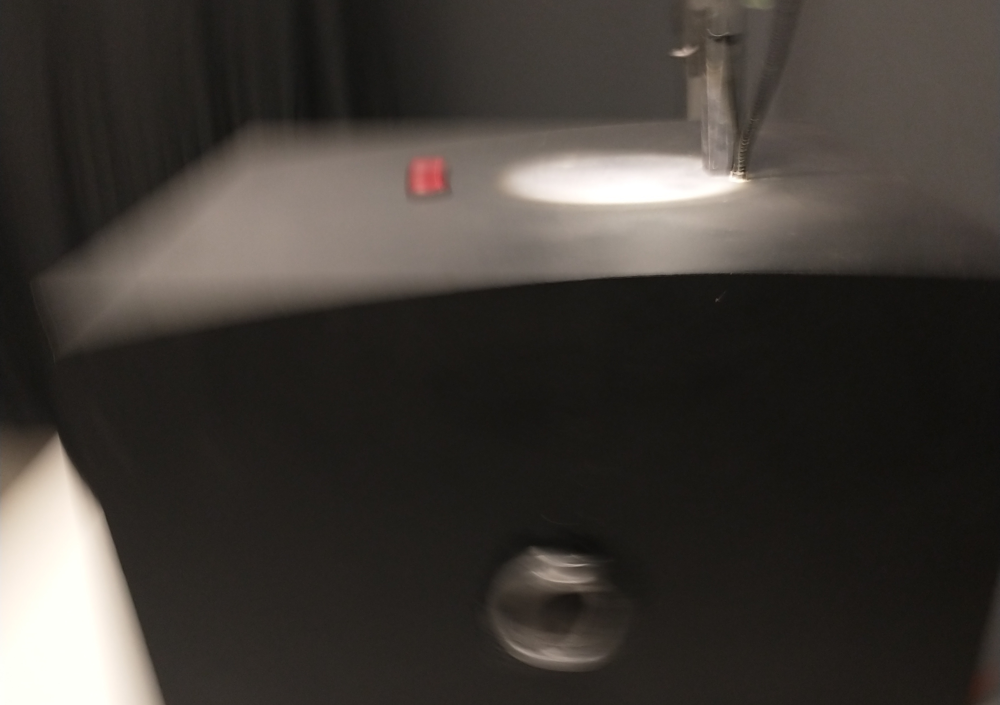
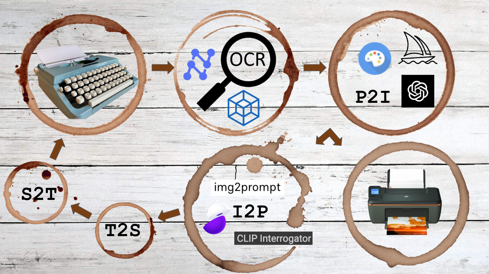

# The Humiliation of the Word (2023)
Computer, inkjet printer, thermal printer, webcam, microphone, electronics, bronze, MDF 
Dimensions: 20 x 20 x 24” 
Technical requirements: Internet connection, 2 outlets 

 

## Statement
*The Humiliation of the Word* is an interactive semi-autonomous installation harnessing computational and electronic art to draw the viewer into a recursive human-AI dialogue. The piece imagines the consequences of unchecked algorithmic hallucination through a translating text to image to speech and back again.  

 

The interactive computational and electronic installation, counterbalancing post-virtual, para-human algorithmic autopoiesis and leaky cybernetic human-AI collaboration, transgresses interfaces between the physical and virtual to reveal the (inter)subjectivity of fleshy bodies in a world of chips and code. Calling to Hito Steyerl’s understanding of the poor image and Artie Vierkant’s notion of the Image Object, the piece brings a Benjaminian understanding of reproducibility through the Pictorial Turn and into an algorithmic age, (dys)functioning in palimpsestic computational autotely. Preordinately obsolescent, it ultimately hopes to act as a techno-epistemic artifact exposing post-digital ontologies, electronic phenomenologies and virtual hermeneutics.  

## [Demo]() (Coming soon to a server near you)
## [Gallery]() (Coming soon to a server near you)
## [R&D](R&D/)
