# Humiliation of the Word

# R
# D

## 230219 - comparative T2I
### [Replicate T2I models](https://replicate.com/collections/text-to-image)
| model | [stability-ai/stable-diffusion](https://replicate.com/stability-ai/stable-diffusion) | [kuprel/min-dalle](https://replicate.com/kuprel/min-dalle) | [borisdayma/dalle-mini](https://replicate.com/borisdayma/dalle-mini) |
|--|--|--|--|
| processor | Nvidia A100 GPU | Nvidia A100 GPU | Nvidia A100 GPU |
| time (est.) | <2s | <16s (var.) | <109s (var.) |
### Prompt
"an angry hamster eating brie in an impressionist style"
### Results
| model | stability-ai/stable-diffusion | kuprel/min-dalle | borisdayma/dalle-mini |
|--|--|--|--|
| time | 14.2 s | 16.3 s | 30.8 s |
| image | 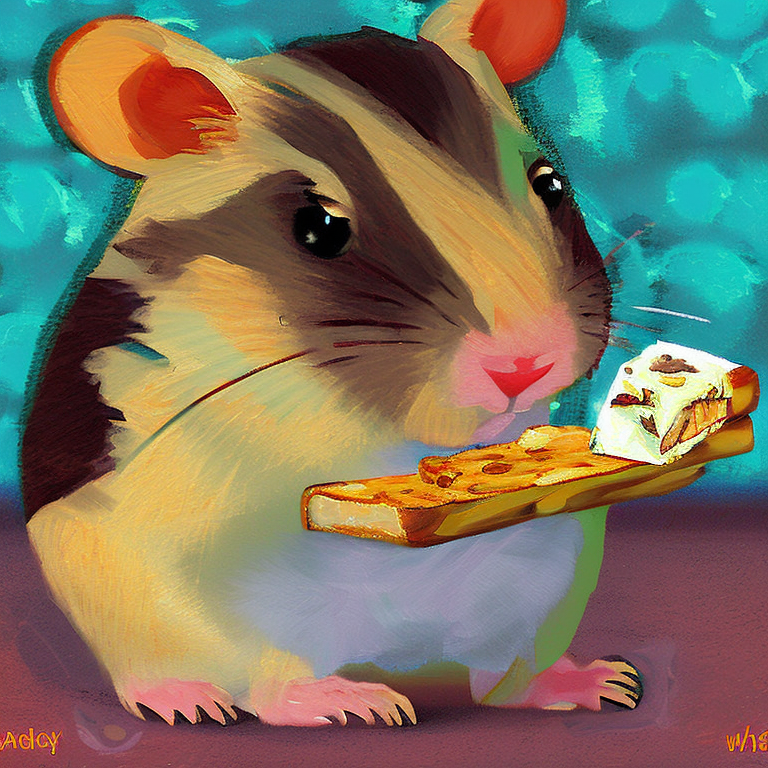 | 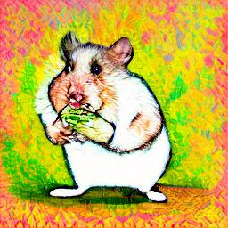 | 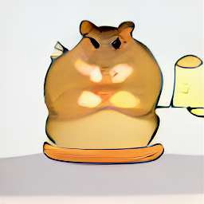 |
### Choice 
[stability-ai/stable-diffusion](https://replicate.com/stability-ai/stable-diffusion)

## 230219 - comparative I2T
### [Replicate I2T models](https://replicate.com/collections/image-to-text)
| model | [salesforce/blip](https://replicate.com/salesforce/blip) | [methexis-inc/img2prompt](https://replicate.com/methexis-inc/img2prompt) | [pharmapsychotic/clip-interrogator](https://replicate.com/pharmapsychotic/clip-interrogator) |
|--|--|--|--|
| processor | Nvidia T4 GPU | Nvidia T4 GPU | Nvidia T4 GPU |
| time (est.) | <1s | <22s | <48s |
### Image
 <br>

### Results
| model | salesforce/blip | methexis-inc/img2prompt | pharmapsychotic/clip-interrogator |
|---|---|---|---|
| time (act.) | 1.1 s | 19.7 s | 92.3 s |
| caption | “Caption: a man holding a bottle of water over his head” | “a man holding a bottle of water over his head, a still life by Zou Yigui, cgsociety, neo-dada, sabattier filter, stock photo, sabattier effect” | “a man sitting at a table with a bottle of liquor, a photo, reddit, process art, there is full bedpan next to him, bending over, i_5589.jpeg, body fitted dart manipulation, he is a mad old man, browns and whites, 4 2 0, cake, loosely cropped, 4 k sharpening, dad” |
| Craiyon |  | 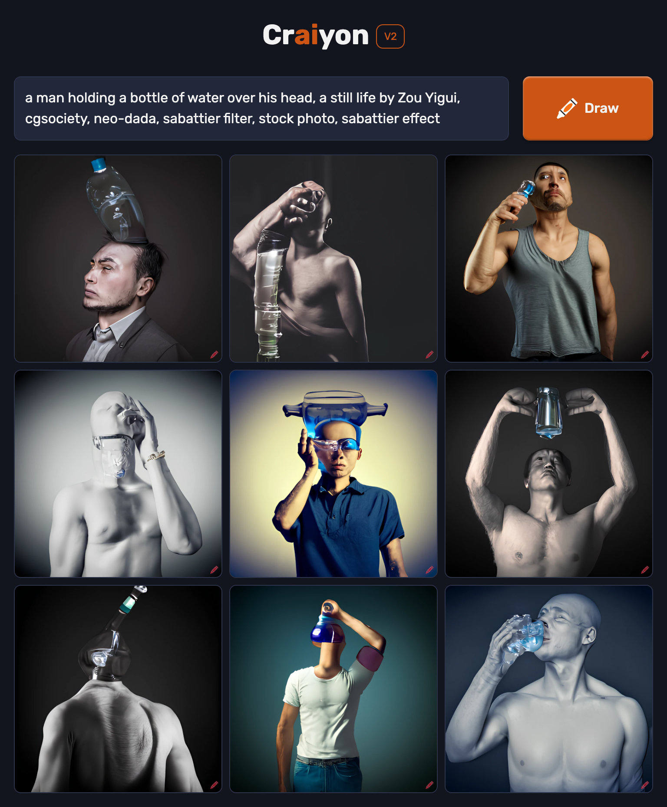 | 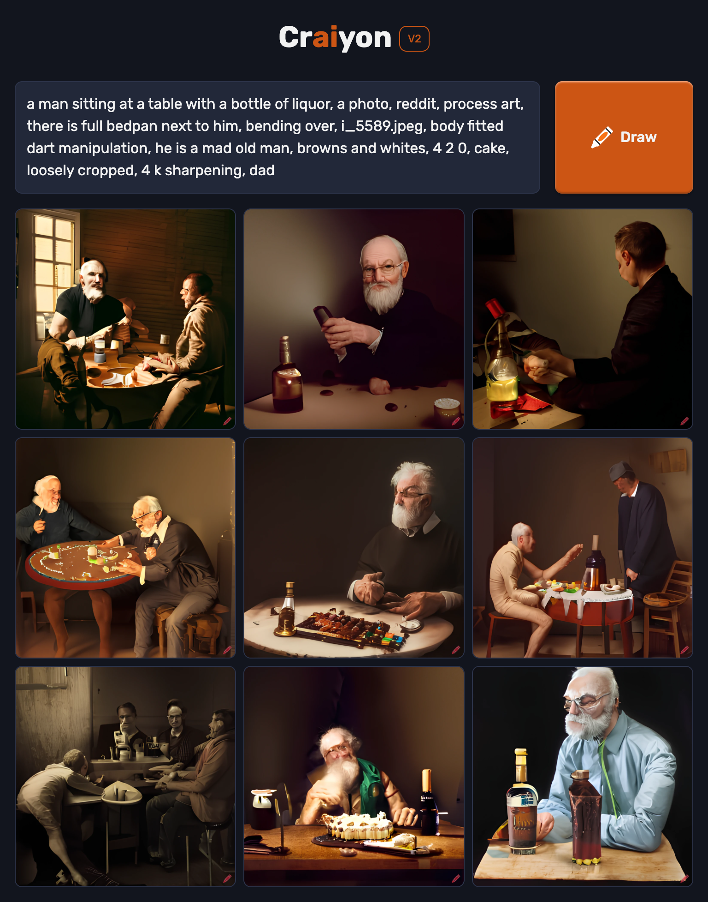 |

### Results pt.2
| CLIP | ViT-H-14/laion (best) | ViT-L-14/openai (best) | ViT-H-14/laion (fast) | ViT-L-14/openai (fast) |
|---|---|---|---|---|
| time (s) | 109.7 | 42.3 |  | 2.3 |
| caption | a man sitting at a table with a bottle of liquor, a photo, reddit, process art, there is full bedpan next to him, bending over, i_5589.jpeg, body fitted dart manipulation, he is a mad old man, browns and whites, 4 2 0, cake, loosely cropped, 4 k sharpening, dad | a man sitting at a table with a bottle of liquor, inspired by Ai Weiwei, neo-dada, photo taken in 2018, smoking a bowl of hash together, blog-photo, épaule devant pose, artforum, anguish, jean gireaud, trending on artforum, gonzo, vignette, stalingrad, ny | a man sitting at a table with a bottle of liquor, smoking a bowl of hash together, over a dish and over a table, drinking and smoking, pouring, there is full bedpan next to him, very coherent image, filling with water, pot, help me, taking tobacco snuff, cooking it up, bending down slightly, smoking a pipe, mixing drinks | a man sitting at a table with a bottle of liquor, drinking and smoking, jean gireaud, épaule devant pose, dsrl photo, chianti molotov cocktails, inspired by Ai Weiwei, inspired by Wolf Vostell, portrait of an alcoholic, la nouvelle vague, inspired by Brassaï, three body problem |
| Craiyon | 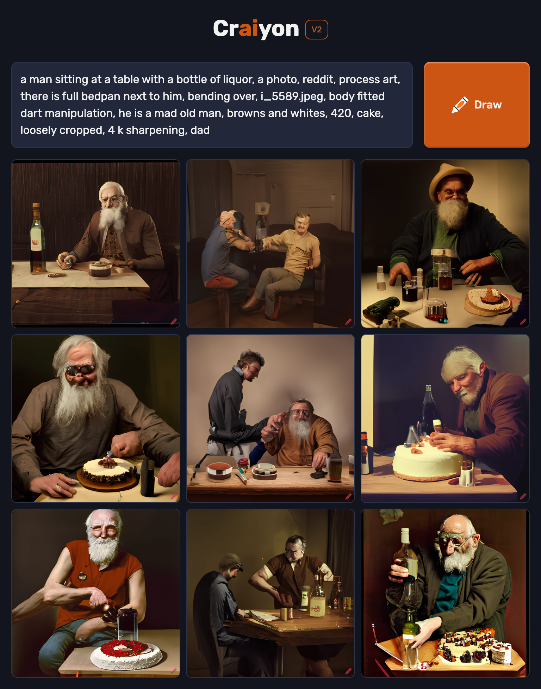 | 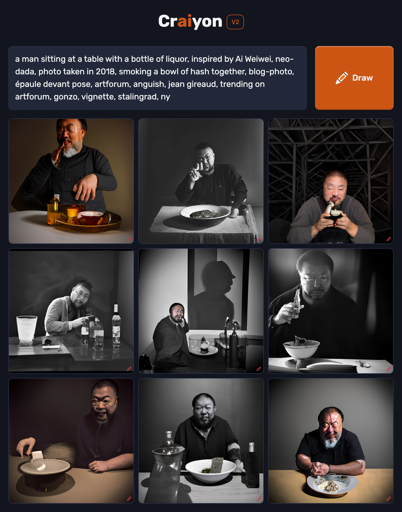 | 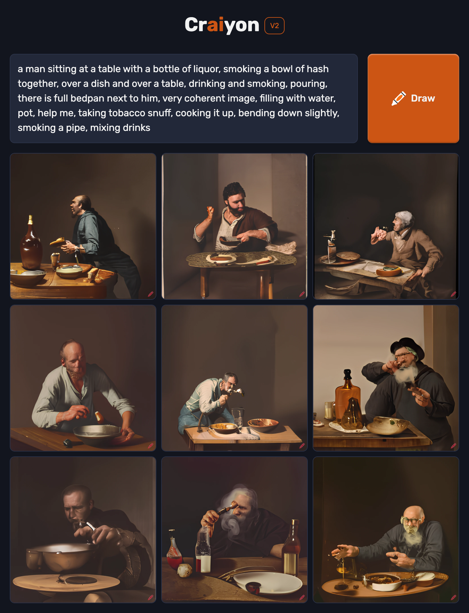 | 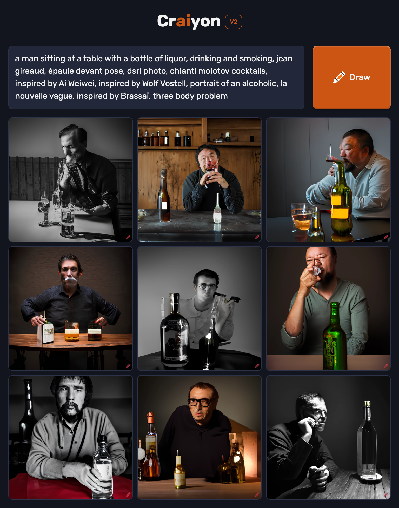 |

## 230220 - printers / IPP

### Printers
#### HP Photosmart 5510 e-All-in-One Printer series - B111
- [HP](https://support.hp.com/ca-en/product/hp-photosmart-5510-e-all-in-one-printer-series-b111/5053904)
- [driver](https://support.hp.com/ca-en/drivers/selfservice/hp-photosmart-5510-e-all-in-one-printer-series-b111/5053904)
- IPP name: `Photosmart 5510 series [789327] http://HP789327.local.:631/ipp/printer`
#### Brother MFC-7840W
- [Brother](https://support.brother.com/g/b/producttop.aspx?c=us_ot&lang=en&prod=mfc7840w_all)  
- [specs](https://support.brother.com/g/b/spec.aspx?c=ca&lang=en&prod=mfc7840w_all)
- [Setting up on wireless network](https://support.brother.com/g/b/faqend.aspx?c=us_ot&lang=en&prod=mfc7840w_all&ftype3=2041&faqid=faq00100429_012) --> OK  
- [NETWORK USER’S GUIDE](https://download.brother.com/welcome/doc002333/mfc7840w_eng_net_a.pdf)
- [PRINTER PAGE!!](http://brn008077e90263.local./main/main.html)


Unsupported document-format "application/pdf" --> use CUPS

Must be image buffer --> works if use fs.readFileSync on local file!
image buffer from URL?


### Python
pyipp ([pypi](https://pypi.org/project/pyipp/)/[gh](https://github.com/ctalkington/python-ipp))  
pyipptool ([gh](https://github.com/ezeep/pyipptool))

### Node
#### https://github.com/fvdm/nodejs-brothermfc


## 230220 - T2I2T
### Python script:
```
import replicate
import webbrowser
modelP2I = replicate.models.get("stability-ai/stable-diffusion")
modelI2P = replicate.models.get("methexis-inc/img2prompt")
outputI2P = "an angry hamster eating brie in an impressionist style"
i = 1
while i < 4:
    # run P2I
    outputP2I = modelP2I.predict(prompt=outputI2P)[0]
    print(outputP2I)
    webbrowser.open(outputP2I)
    # run I2P
    inputs = { 'image': outputP2I, }
    outputI2P = modelI2P.predict(**inputs)
    print(outputI2P)
    # increment counter
    i += 1
```
### Results
`an angry hamster eating brie in an impressionist style` <br>
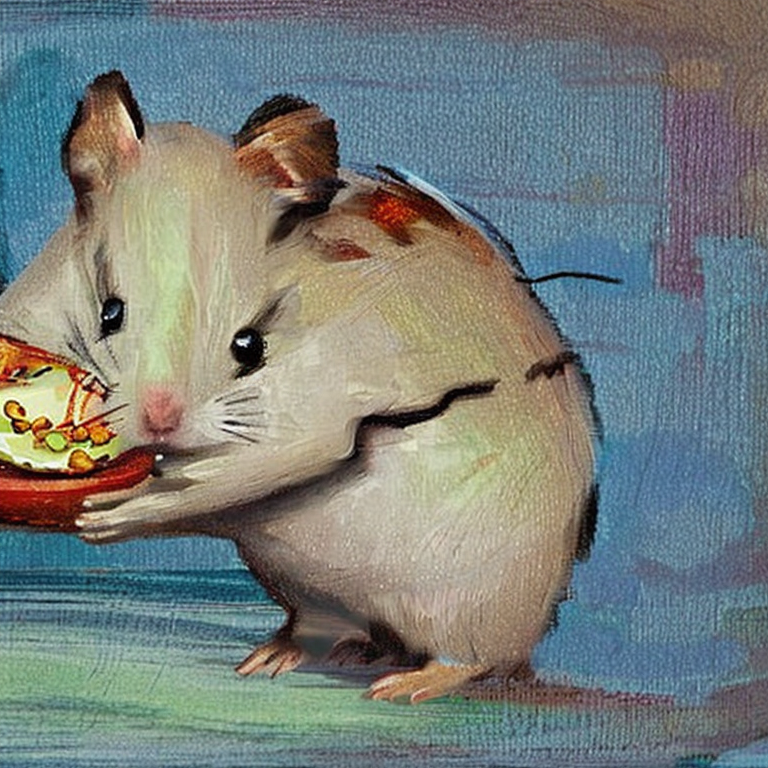 <br>
`a painting of a mouse eating a piece of cake, a gouache by Peter de Seve, featured on deviantart, sots art, speedpainting, oil on canvas, storybook illustration` <br>
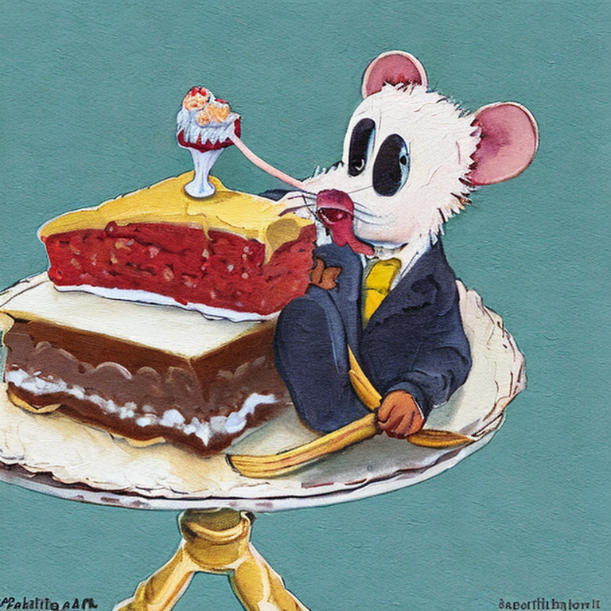 <br>
`a painting of a mouse on a plate with a piece of cake, a storybook illustration by John Nelson Battenberg, trending on deviantart, pop surrealism, storybook illustration, whimsical, detailed painting` <br>
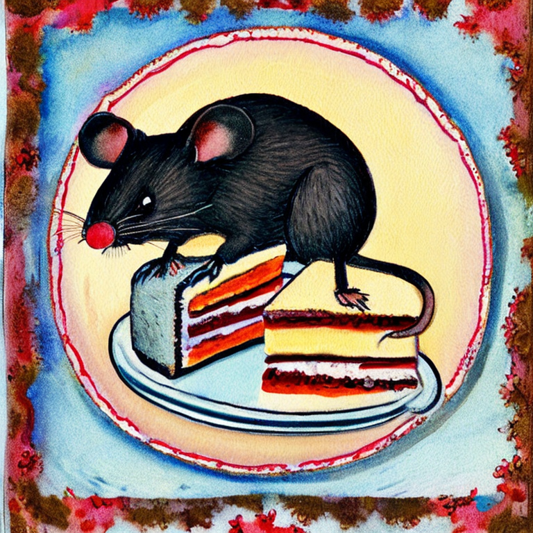 <br>
`a painting of a mouse on a piece of cake, a pastel by Betye Saar, deviantart, folk art, storybook illustration, whimsical, mixed media`

## 230220 - OCR
### Python script:
```
from PIL import Image
import pytesseract
import numpy as np
print(pytesseract.image_to_string(np.array(Image.open('test3.png'))))
```
### Screenshot
#### Actual
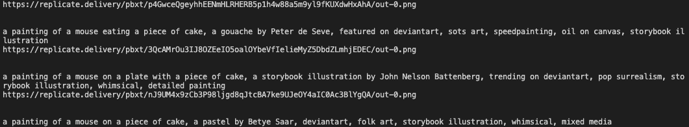 <br>
```
https://replicate.delivery/pbxt/p4GwceQgeyhhEENmHLRHERB5p1h4w88a5m9yl9fKUXdwHxAhA/out-0.png  
a painting of a mouse eating a piece of cake, a gouache by Peter de Seve, featured on deviantart, sots art, speedpainting, oil on canvas, storybook illustration  
https://replicate.delivery/pbxt/3QcAMrOu3IJ8OZEeIO5oalOYbeVfIelieMyZ5DbdZLmhjEDEC/out-0.png  
a painting of a mouse on a plate with a piece of cake, a storybook illustration by John Nelson Battenberg, trending on deviantart, pop surrealism, storybook illustration, whimsical, detailed painting  
https://replicate.delivery/pbxt/nJ9UM4x9zCb3P98ljgd8qJtcBA7ke9UJeOY4aIC0Ac3BlYgQA/out-0.png  
a painting of a mouse on a piece of cake, a pastel by Betye Saar, deviantart, folk art, storybook illustration, whimsical, mixed media  
```

#### OCR
```
https: //replicate.delivery/pbxt/p4GwcedgeyhhEENmHLRHERBS p1h4w8Ba5moy 19 fKUXdWHXANA/out—O. png

a painting of a mouse eating a piece of cake, a gouache by Peter de Seve, featured on deviantart, sots art, speedpainting, oil on canvas, storybook il
lustration  
https: //replicate.delivery/pbxt/3QcAMr0u31J80ZEeT050a10YbeVfe1ieMyZ5DbdZLmhjEDEC/out-0.png

a painting of a mouse on a plate with a piece of cake, a storybook illustration by John Nelson Battenberg, trending on deviantart, pop surrealism, sto
rybook illustration, whimsical, detailed painting  
https: //replicate.delivery/pbxt/nJ9UM4x92Cb3P981j gd8qJtcBA7ke9UJe0Y4aICOAC3B1YgQA/out-0. png

a painting of a mouse on a piece of cake, a pastel by Betye Saar, deviantart, folk art, storybook illustration, whimsical, mixed media
```

#### Processed
```
https: //replicate.delivery/poxt /p4Gweedg eynnEENMHLRHERSS pln4w8saSmoy LST KUXdWHxANA/out—O. png

a painting of a mouse eating a piece of cake, 2 gouache by Peter de Seve, featured on deviantart, sots art, speedpainting, oil on canvas, storybook it
lustration
https: //replicate.deLivery/pbxt/3QcAMrOu31J80ZEeT050a LOYbeV Tel ieMyZ5DbdZLnhjEDEC /out-2.png

a painting of a mouse on a plate with a piece of cake, a storybook illustration by John Nelson Battenberg, trending on deviantart, pop surrealism, sto
rybook illustration, whimsical, detailed painting
https: //replicate.deLivery/pbxt /nJ9UM4x9zCD3P981j gd8qJtcBA7ke9UJe0Y4aTCoAc3BLYaQA/out-2.png

a painting of a mouse on a piece of cake, a pastel by Betye Saar, deviantart, folk art, storybook illustration, whimsical, mixed media
```

### Typewriter 1 (Photo raw)
#### Actual
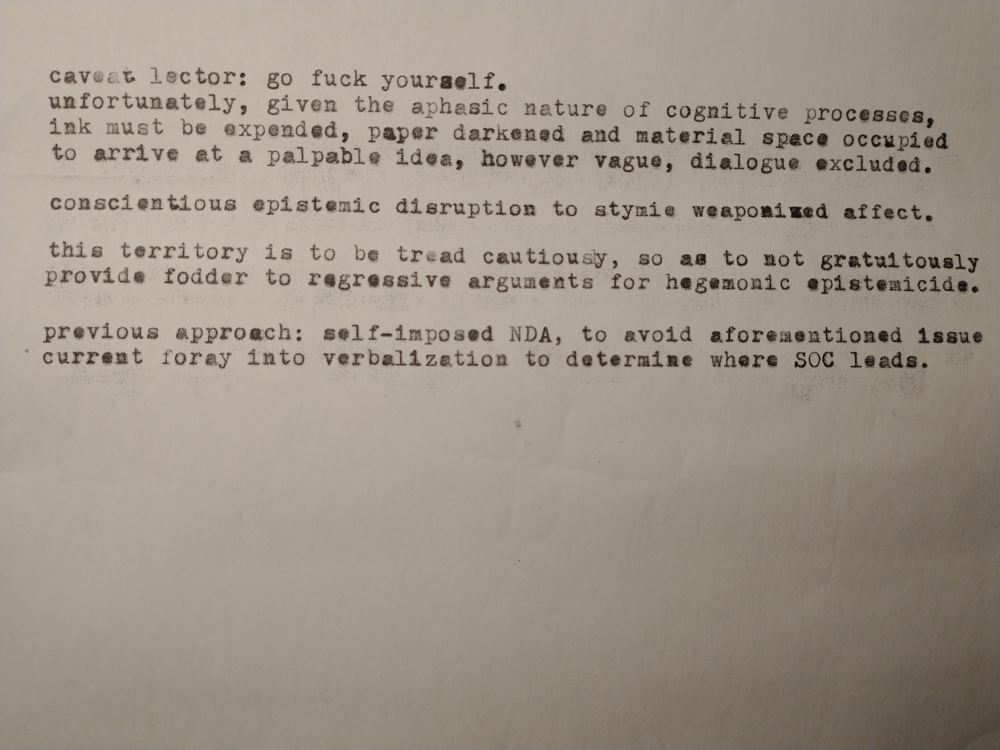 <br>

#### OCR
```
Caveat lector: go fuck yourgelf,
unfortunately, given the aphasic nature of cognitive process.
ink must be expended, paper darkened and material space occu
to arrive et a palpable idea, however vague, dialogue exclu

conscientious epistemic disruption to atymie weapomiwed affect.

this territory is to be tread Cautiousy, so aa to mot gr

provide fodder to regressive arguments for hegemonic episte

Ms
am
¥ eis

o

an

<. 2 are +h

current foray into verbalization to determine where SOC

Loa

@


```
#### Processed
```
Cayo. % tector: go fuck yourgelf,

unfortunately, given the e:hesic nature of cognitive processes,
ink cust be expended, paper darkened and material space occupied
to arrive at a palpable idea, however vague, dialogue excluded, —

conscisntblous epistemic disruption to stymie weapomiwed affect,

this territory is to be triad Cautioucy, so ag to mot gratuitously
provice fodder to regressive argusents for hegemonic @#plstemicide,

previous mpproach: self-imposed WDA, to avoid aforenentioned issue
current foray into verbalizetion to determine where SOC leada. —

```

### Typewriter 2 (Photo cropped)
#### Actual
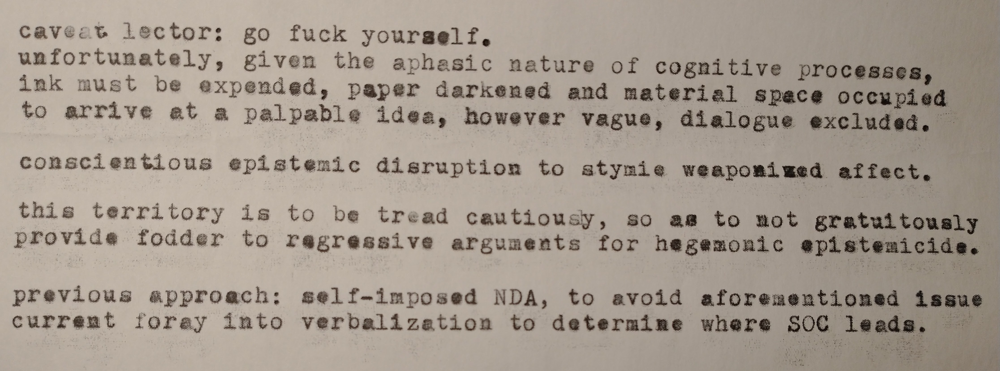 <br>

#### OCR
```
Caveat lector: go fuck yourgelf,
unfortunately, given the aphasic nature of cognitive processes,
ink must be expended, paper darkened and material spece occupied
*o arrive at a palpable idea, however vague, dialogue excluded. —

conscientious @¢pistemic disruption to stymie weapomiwed affect,

this territory is to be tread cautiousy, so aa to not gratuitously
provide fodder to regressive arguments for hegemonic @pistemicide.
previous approach: self-imposed NDA, to avoid aforeuentioned issue
current foray into verbalization to determine where SOC leads,
```
#### Processed
```
Cayo. itvcctor: go fuck yourgelf,

unfortunately, given the a:hesic nature of cognitive processes,
ink cust be expended, paper darkened and material space occupied
to arrive at a palpable idea, however vague, dialogue excluded. _

conscientious é@pistexic disruption to atymie weapomined affect,

this territory is to be tread Cautiousy, so aa to not gratultoualy
proviue fodder to regressive argusents for hegemonic @pletemicide.

previous mpproach: self-imposed WDA, to avoid aforenentioned issue
current roray into verbalization to determine where SOC leada. —
```
### Typewriter 3 (Scan Raw)
#### Actual
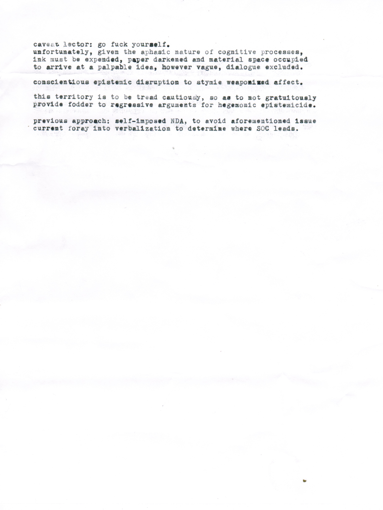 <br>

#### OCR
```
caveat lector: go fuck yourself.

unfortunately, given the aphasic nature of cognitive processes,
ink must be expended, paper darkened and material spece occupied
to arrive at a palpable idea, however vague, dialogue excluded.

conscientious epistemic disruption to stymie weapomimwed affect,

this territory is to be tread cautiousy, so ag to not gratuitously
provide fodder to regressive arguments for hegemonic epistemicide.

previous approach; self-imposed NDA, to avoid aforementioned issue
‘current foray into verbalization to determine where SOC leads.
```
#### Processed
```
Cave. .cctor: go fuck yourgelf.

unfortunately, given tne a. nesic acture Ci Cogniviv: .rocessis,
ing aust pe exienuaed, rapper darnened and material space occu:ied
to arrive at a palpable idea, however vague, dialogue exciuded.

conscientious epistenic disruption to styzie weapomimged affect,

this territory is to ve triad cautiou y, so ag to not gratuitously
provide fodder to regressive ariguaents for negemouic eapistesiciae.

previous approach: self-imvosed WDA, to sevoid afcresertioned issue
current :orey into verbalizetion to determine shere SUC leeds.
```

### Typewriter 4 (Scan cropped)
#### Actual
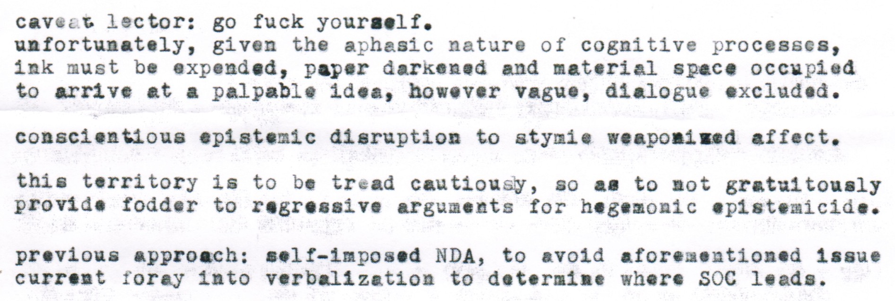 <br>

#### OCR
```
caveat lector: go fuck yourself.

unfortunately, given the aphasic nature of cognitive processes,
ink must be expended, paper darkened and material spece occupied
to arrive at a palpable idea, however vague, dialogue excluded.

conscientious epistemic disruption to stymie weapomimed affect,

this territory is to be tread cautiousy, so as to not gratuitously
provide fodder to regressive arguments for hegemonic epistemicide.

previous approach; self-imposed NDA, to avoid aforementioned issue
current foray into verbalization to determine where SOC leads.
```
#### Processed
```
Cave. itctor: go fuck yourself.

unfortunately, given tne a nesic ai ture Ci Cognivlv: .rocessis,
ing aust oe exnended, rapper darnened and material space occuiud
to arrive at a palpable idea, however vague, dialogue exciuded.

conscientious epistenic disruption to styrie weapomiwed affect.

this territory; is to ve triad cautiou y, su ag to not gratuitously
provide fodder to regressive ar.uaents for negemouic apistesiciae.

previous approach: self-imvosed NDA, to svoid afcoresertioned issue
current :orey into verbalizetion to determine shere SUC leeds.
```

